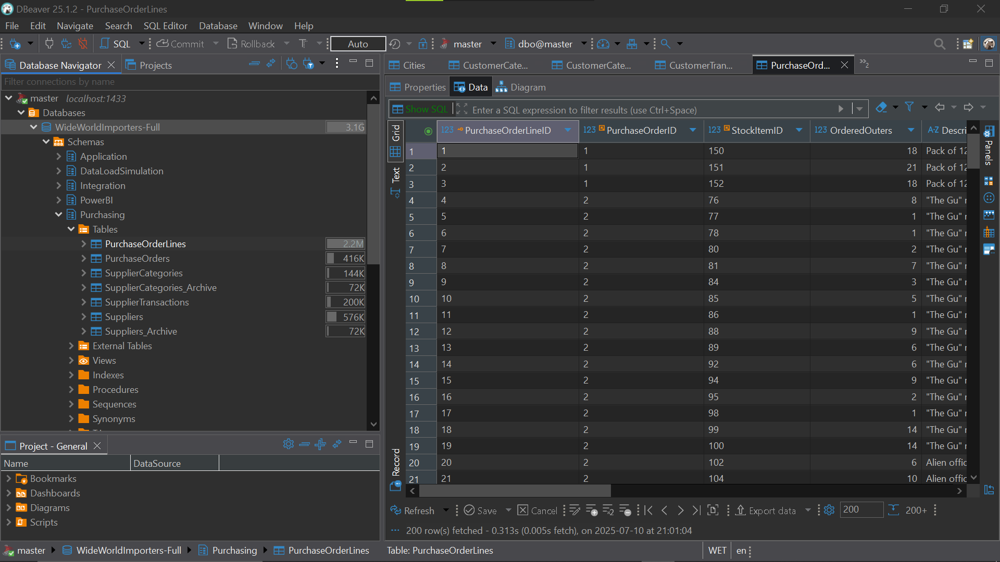
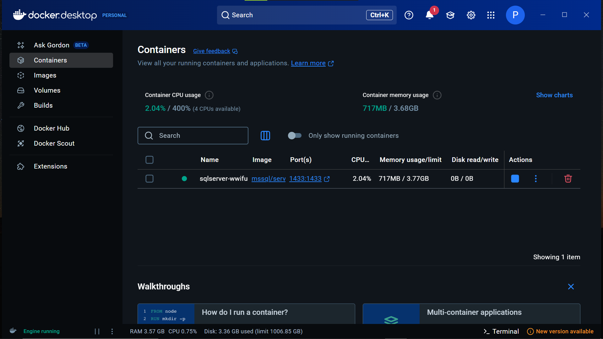

# **NL2SQL PLAN**

### **Table of Contents**

1. Executive Summary :
2. Proposed System Architecture : 
	1. Guiding Principles.
	2. High-Level Architectural Flow.
	3. Detailed Component Breakdown.
3. Development Strategy & Phased Plan.
	1. Methodology : Iterative and Agile.
	2. Phase 1 : The core Engine (NL-to-Data Pipeline)
	3. Phase 2: The full MVP (Presentation Layer & UI)
4. Project Deliverables : 
    1. Deliverable 1: Standalone MVP Web Application
    2. Deliverable 2: The Core Engine (Productized Backend)
    3. Deliverable 3: The Integration Roadmap
5. Evaluation Framework & Success Metrics
6. Security & User Trust Architecture
7. Conclusion & Next Steps
---
### **Summary**

This document outlines a detailed plan for the development of the **Natural Language to SQL (NL2SQL)** feature for BI software **OptiBoard**. The vision is to create a system that empowers users to query databases using plain French or English.

The proposed architecture is a secure, modular **multi-agent system** where specialized AI and rule-based components collaborate to deliver high-quality results. The core of the system leverages a **Retrieval-Augmented Generation (RAG)** pattern to ensure generated SQL is accurate and contextually aware. A paramount focus is placed on security, with a custom-built validation gate to inspect every query before execution.

To ensure tangible progress and manage complexity within the internship period, development will follow a **phased, iterative approach**. The immediate priority (**Phase 1**) is to build the foundational **Core Engine**, a robust backend service that handles the entire secure NL-to-Data pipeline. This will be followed by **Phase 2**, which will build out the advanced presentation layer and a standalone MVP web application for demonstration and testing.

---
### **Proposed Architecture**
#### *Guidings Principles*

- **Multi-Agent System:** The architecture is a multi AI agents structure. Each component has a single responsibility, leading to higher quality, better performance, and easier maintenance than a monolithic approach.
    
- **Security First:** The system is designed with a "Defense in Depth" strategy. We do not trust the LLM; every output is validated by a deterministic, rule-based security gate.
    
- **Dynamic & Stateless:** The backend is designed to connect to user-specified databases dynamically without ever storing credentials, ensuring user data privacy and security.
    
- **Modular & Scalable:** Each component is built as a distinct module, allowing for easy testing, improvement, and future expansion.
---
#### *High-Level Architecture*

User Input: NL Question & DB Credentials
           |
           v
1. API Gateway: Receives and validates request
           |
           v
2. Scoping Agent (LLM): Identifies relevant tables for the query
           |
           v
3. Schema Manager: Retrieves DETAILED schema for ONLY the relevant tables
           |
           v
4. SQL Generation Agent (LLM): Generates raw SQL using the FOCUSED schema
           |
           v
5. Security Gate (Rules): Parses and validates the SQL for safety
           |
           v
6. Query Executor: Executes the SAFE query against the user's DB
           |
           v
7. Presentation Layer Agents (Hybrid): Generate visuals & narrative
           |
           v
8. Final Assembly: Combines all parts into a structured Dashboard object
           |
           v
Final Output: JSON Report to Frontend

---
#### *Detailed Component 

1. **API Gateway (FastAPI):** The main entry point. It defines /test-connection and /query endpoints and orchestrates the entire workflow.

2. **[[24_Handling_Schema_Complexity_With_A_Scoping_Agent|Scoping Agent (LLM)]]:**   The first agent in the pipeline. It analyzes the user's question against a high-level overview of the entire database to intelligently identify and select the small subset of tables that are relevant to the query. This is key to handling complex, large-scale databases.
    
3. **Schema Manager:** Handles dynamic, temporary database connections using provided credentials to retrieve table and column metadata. Connects to the DB and retrieves the **detailed schema** for *only the subset of tables* identified by the Scoping Agent.

4. **SQL Generation Agent:** An LLM-based agent that translates the natural language question into a SQL query.
    
5. **Security Gate:** A custom-built, rule-based agent that parses every generated SQL query, whitelisting only SELECT statements and ensuring it adheres to the known schema and follows defined rules of credentials.
    
6. **Query Executor:** A simple service that executes the validated SQL query against the target database.
    
7. **Presentation Layer:** A collection of agents that process the data results:
    
    - **Standard Visualizer (Rule-Based):** A deterministic agent that recommends a set of basic, reliable charts (e.g., table, bar, line) based on the data's structure.
        
    - **Suggested Visualizer (LLM-Based):** A creative agent that brainstorms advanced or alternative chart ideas.
        
    - **Narrative Agent (LLM-Based)***(to be discussed later)* :  A writing agent that generates an executive summary and per-visual interpretations for the final report.
--- 
####   ***Project's global Structure***

<pre><code><strong>NL2SQL_MVP_Project/</strong>

├── .env.example              # Template for environment variables (DB URLs, API Keys)
├── .gitignore               
├── Dockerfile                # For containerizing the backend (Deliverable #2)
├── README.md                 
└── requirements.txt          

<strong style="color:#3949ab;">#================ Backend Service ================#</strong>
└── <strong>backend/</strong>
    ├── .venv/               
    │
    └── <strong>src/</strong>
        ├── <strong>api/</strong>
        │   ├── __init__.py
        │   ├── endpoints.py       # Defines the FastAPI routes (/test-connection, /query)
        │   └── models.py           # Pydantic models for request/response bodies
        │
        ├── <strong>core/</strong>
        │   ├── __init__.py
        │   └── pipeline.py         # The main orchestrator that runs the entire agent pipeline
        │
        ├── <strong>agents/</strong>             # Each specialized "agent" gets its own module
        │   ├── __init__.py
        │   ├── scoping_agent.py
        │   ├── sql_generator.py            # Agent 2: Generates SQL (LLM-based)
        │   ├── security_validator.py      # Agent 3: Validates SQL (Rule-based)
        │   ├── visualization.py              # Agent 4: Standard & Suggested visuals (Hybrid)
        │   └── narrative.py                   # Agent 5: Generates text summary or dashboard
        │
        ├── <strong>services/</strong>           # Lower-level services used by the agents
        │   ├── __init__.py
        │   ├── db_executor.py                  # Executes the final SQL query
        │   └── schema_manager.py         # Connects to DB, gets schema
        │
        ├── <strong>utils/</strong>
        │   ├── __init__.py
        │   └── data_formatter.py           # Helper to structure raw DB results
        │
        └── main.py             

<strong style="color:#3949ab;">#================ Frontend Web App ================#</strong>
└── <strong>frontend/</strong>
    ├── index.html            
    ├── css/
    │   └── styles.css        
    └── js/
        ├── app.js            
        └── api.js            
</code></pre>

---
### **Development Strategy & Phased Plan

#### *Methodology: Iterative and Agile

The project will be developed iteratively. This approach allows for rapid prototyping of core features, early feedback, and a flexible response to technical challenges, ensuring a valuable and functional product is delivered by the end of the internship.

---
#### *Phase 1: The Core Engine (NL-to-Data Pipeline)

- **Objective:** To build and thoroughly test the foundational backend service. This phase focuses on solving the most complex technical challenges first.
    
- **Scope:** Backend development only.
    
- **Key Tasks:**
    
    1. Implement the FastAPI server with /test-connection and /query endpoints.
        
    2. Build the SchemaManager to handle dynamic database connections.
        
    3. Implement the SQLGenerator and the critical SecurityGate.
        
    4. Implement the QueryExecutor and data formatting utilities.
        
- **Deliverable:** A functional backend API. Functionality will be demonstrated via API testing tools (e.g., FastAPI's /docs UI), showing that a question can be securely converted to a query and return data from a database.
---
#### *Phase 1 Simplified Structure :

<pre><code><strong>nl2sql-core-engine/</strong>
│
├── .env.example              
├── .gitignore                
├── README.md                 
└── requirements.txt          
│
└── <strong>backend/</strong>
    │
    └── <strong>src/</strong>
        │
        ├── __init__.py         # Makes 'src' a Python package
        │
        ├── main.py             # Entry point: Creates the FastAPI app instance
        │
        ├── <strong>api/</strong>
        │   ├── __init__.py
        │   ├── endpoints.py    # Defines API routes like /query and /test-connection
        │   └── models.py       # Pydantic models for request and response data
        │
        ├── <strong>core/</strong>
        │   ├── __init__.py
        │   └── pipeline.py     # Main orchestrator for the NL-to-SQL-to-Data process
        │
        ├── <strong>agents/</strong>
        │   ├── __init__.py
        │   ├── sql_generator.py               # Responsible for generating the SQL query (LLM)
        │   └── security_validator.py         # Responsible for validating the generated SQL (Rules)
        │
        ├── <strong>services/</strong>
        │   ├── __init__.py
        │   ├── db_executor.py                # Responsible for executing a validated SQL query
        │   └── schema_manager.py       # Responsible for DB connection and schema retrieval
        │
        └── <strong>utils/</strong>
            ├── __init__.py
            └── data_formatter.py      # Helper functions, e.g., for formatting DB results
</code></pre>

---
#### *Phase 2: The Full MVP (Presentation Layer & UI)

- **Objective:** To build upon the stable core engine to create a full-featured, demonstrable application that can handle complex, real-world database schemas.
    
- **Scope:** Both backend and frontend development.
    
- **Key Tasks:**
    
    1. **Enhance the backend by implementing the Scoping Agent**. This architectural upgrade is the key to enhance the SQL Generator accuracy by limiting the the Database schema's context to only the relevant tables for the user's prompt.
        
    2. Implement the Presentation Layer agents (visualization and narrative).
        
    3. Develop a simple, clean standalone web interface.
        
    4. Integrate the frontend with the enhanced backend API to create the full user experience.
---
### **Project Deliverables**

Upon completion, this project will yield three distinct, high-value deliverables:
#### *Deliverable 1: Standalone MVP Web Application

A self-contained, demonstrable web application that showcases the end-to-end functionality of the system.

#### *Deliverable 2: The Core Engine (Productized Backend)

The fully documented, configuration-driven backend service, packaged with a Dockerfile for easy deployment. This is the primary technical asset for future real integration of the feature in the OptiBoard Software.

#### *Deliverable 3: The Integration Roadmap

A formal document detailing the system architecture, API contracts, and a recommended strategy for integrating the Core Engine into the company's main BI software product.

---
### **Evaluation Framework & Success Metrics**

To ensure quality, the system will be evaluated continuously against a pre-defined "Golden Dataset" of questions and expected outcomes.

- **SQL Correctness:** Measured by **Execution Match Accuracy**, where the data returned by the generated SQL must be identical to the data from a manually-written correct query.
    
- **Security:** The **Malicious Query Rejection Rate** of our Security Gate must be 100%.
    
- **Presentation Quality:** The accuracy of the standard chart recommendations will be measured, and the quality of the narrative will be assessed through manual review based on relevance and correctness.
---
### **Security & User Trust Architecture**

User trust is paramount. The system is designed with a "Defense in Depth" security model:

1. **User Guidance:** We will strongly advise users to connect with **read-only** database accounts.
    
2. **Transport Security:** All communication will be encrypted with **HTTPS**.
    
3. **Stateless Backend:** User credentials are **never stored**. They are used ephemerally for each request and then discarded.
    
4. **Runtime Validation:** The custom **Security Gate** provides the strongest layer of protection by inspecting every query, ensuring that even a compromised or "jailbroken" LLM cannot execute a harmful command.
---
###  ***Database & Next Steps***

My next step is to begin the implementation of **Phase 1**. The following sections detail the specific technical environment and workflow for this initial and most critical stage of the project :

#### **1. The Development Database: WIdeWorldImporters**

To ensure the NL2SQL system is built and tested against a realistic, industry-relevant dataset, I'll use Microsoft's official sample database, **WideWorldImporters**.

- **What It Is:** Wide World Importers is a fictional novelty goods wholesaler and importer. The database represents its complete B2B (Business-to-Business) operations, providing a rich and complex schema that is more representative of modern database design than older samples.
    
- **Why It Is Useful:** Its structure is normalized and contains numerous interconnected tables with advanced data types (like JSON and temporal data). This makes it an excellent benchmark that forces the NL2SQL system to generate complex queries involving multi-table JOINs, aggregations, and filtering, which is essential for proving the system's capabilities.
    
- **Alternative Sample Databases:** While other industry-standard sample databases exist, such as **Chinook** and **Sakila**, we will proceed with **Wide World Importers** as it is the most up-to-date and comprehensive sample for the SQL Server environment.
---
#### **2. Database Structure and Versions**

The Wide World Importers database is available in two distinct versions, which are central to our phased development strategy.

**Version 1: The Transactional Database (WideWorldImporters OLTP)**

- **Structure:** This is a highly normalized database with approximately 50 tables organized into logical schemas like Sales, Purchasing, Warehouse, and Application. Key tables include Sales.Orders, Sales.Customers, Warehouse.StockItems, and Purchasing.Suppliers. The relationships require complex JOIN operations to link customers to the products they ordered, track stock, and manage purchases.
    
- **Purpose:** This will be the **primary database for the entire project**. Its complexity is representative of a real-world operational database.

**Version 2: The Data Warehouse (WideWorldImportersDW)**

- **Structure:** This is an analytical (OLAP) version of the database. Its schema is "denormalized" into Fact and Dimension tables, which is optimized for BI reporting and analytics.
    
- **Purpose:** This version will be used later for **advanced testing and validation**. A key success metric will be observing how our NL2SQL agent adapts its query generation strategy when faced with this different, report-optimized schema. 
---
#### **3. Hosting Technology: SQL Server via Docker**

To work with this database, we need the **SQL Server** database management system (RDBMS).

- **Local Hosting Strategy:** To create a secure, isolated, and easily manageable development environment, we will run SQL Server locally using **Docker**.
        
    - We will use Microsoft's official **image** (a blueprint for SQL Server) to create a running **container** on the local machine.
        
    - The WideWorldImporters database will be restored from a backup file (.bak) into this running SQL Server instance.
        
- **Outcome:** This setup provides a fully functional, industry-standard SQL Server database that is private to the development machine and can be started, stopped, and removed cleanly.

    

---
#### **4. Phased Development Workflow with the Database**

The use of the WideWorldImporters database is tied directly to the project's phased development plan.

- **Phase 1 - Core Engine Development:**
    
    1. The local Docker environment with the **WideWorldImporters** transactional (OLTP) database will be configured.
        
    2. The backend API will be developed to accept database connection details.
        
    3. During testing, the API will be given the connection string for the local WideWorldImporters instance. We will manually provide a **focused context** to the LLM, concentrating on a subset of tables (e.g., only those in the Sales schema) to prove the core logic.
        
    4. The success of this phase will be defined by the system's ability to correctly generate and execute secure SQL queries against this controlled, focused schema subset.
        
- **Phase 2 - Full MVP and Scalability:**
    
    1. The backend architecture will be enhanced with the **Scoping Agent**.
        
    2. The system will then be tested against the **entire WideWorldImporters database**. The Scoping Agent's role will be to automatically identify the correct schema subset (e.g., Sales, Warehouse) for any given question, validating its effectiveness in handling a large, complex schema.
        
    3. The frontend UI will be developed, allowing a user to provide their own database credentials. The backend, now equipped to handle complex schemas, will process these requests and return a full report object with data that can be plotted in different visuals. 
    
    4. The Frontend will also have the feature of testing the web App against custom Database (which will be WWI) for users who wants to test the App, that will be possible after we deploy the WWI database into Cloud and set the permissions for read-only, in the UI will be a try sample DB feature that connets directly to the db and allow users to test the sql generation.
    
